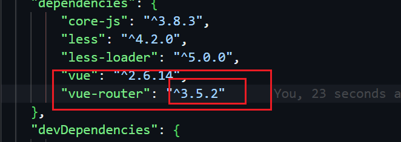
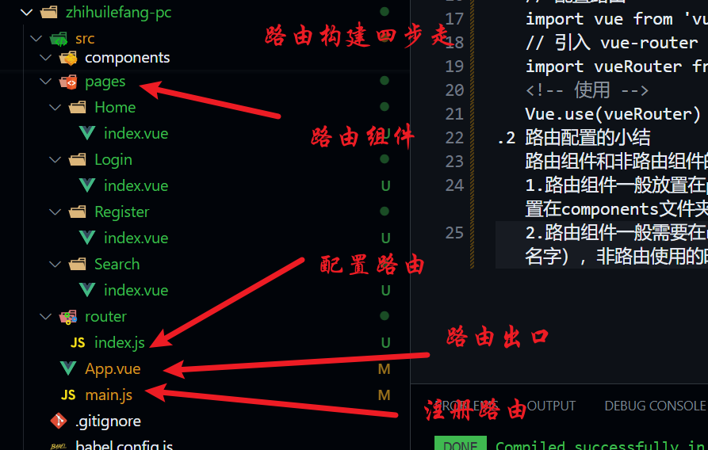

## 智慧乐坊商城 pc端

## 搭建步骤

1.导入静态的架构
2.引入less,下载less依赖
3.在根组件引入header、Footer组件
4.注册、使用组件
5.路由的引入(路由搭建）下载vue-router npm install --save vue-router
 注意安装的版本-一般安装稳定版
  components文件夹：放置的是非路由组件（哪里需要哪里搬）
  pages|views文件夹：放置的路由组件（路由组件有四个-Home Search Login Register
5.1 配置路由
项目当中配置的路由放置在router中
    创建router文件夹：
    // 配置路由
    import vue from 'vue';
    // 引入 vue-router
    import vueRouter from 'vue-router'; 
    <!-- 使用 -->
    Vue.use(vueRouter)
5.2 路由配置的小结
    路由组件和非路由组件的区别？
    1.路由组件一般放置在pages|views文件当中 非路由组件一般放置在components文件夹中
    2.路由组件一般需要在router中文件中进行注册（使用是组件的名字），非路由使用的时候，一般都是以标签的方式使用
    路由四步走
    
    3.注册完路由：不管是路由组件和非路由组件都有$route\$router属性
    $route :一般获取路由信息【路径、query、params等】
    $router:一般进行编程式导航进行路由跳转【push|replace】
5.3 路由的跳转
    两种形式：
        1.声明式导航：router-link,可以进行路由的跳转
        2.编程式导航：push|replace，可以进行路由的跳转

        编程式导航：声明式导航能做到的，编程式导航都能做
        但是除了编程式导航，还可以进行路由跳转，还可以做一些其他的业务逻辑
6.Footer显示和隐藏的业务（组件的显示和隐藏）
    在home和search页面中是隐藏的，其他是显示的
    v-if | v-show 
    v-if：是操作dom，耗性能
    v-show:样式的显示和隐藏
    6.1 根据组件身上的$route去获取组件的路由信息，通过路由路径的判断footer显示和隐藏（但是不是最优方案）
    使用在router中添加meta源信息来判断（路由源信息），路由是需要配置对象，它的key不能乱写
    <!-- <FooterIndex v-show="$route.path=='/home'||$route.path=='/search'"/> -->
    <FooterIndex v-show="$route.meta.show"></FooterIndex>
7.路由传参
    7.1路由跳转的方式？几种？
    A->B
    1.声明式导航：router-link
    2.编程式导航：push|replace，可以进行路由的跳转（可以写一些业务再进行跳转）
    7.2 路由传参、参数有几种写法？
    params参数：属于路径当中的一部分，需要注意，在配置路由的时候，需要占位，
    query参数：不属于路由中的一部分，类似于ajax中的querystring /home?k=v&kv=,不需要站位
    7.3【业务】 实现输入栏输入关键词，点击搜索按钮，实现带参数的页面的跳转
8.【面试题】【问题解决】【回看】
9.HOME 模块拆分【业务】
    --先把静态的页面完成
    --拆分出静态组件
    --获取服务器的数据进行展示
    --动态业务
    【业务】三级联动在home、search、detail都出现过-如果某个组件在很多地方使用，就注册为全局组件（只需注册一次）
    完成其它静态组件：HTML CSS 图片资源
10.postman接口测试
    --接口没问题  
    --200，代表服务返回成功
    --整个项目，接口前缀都有api/
11.axios的二次封装（发送请求）
    XMLHttpRequest 、fetch、JQ、axios
    11.1为什么要二次封装axios? npm install --save axios
    请求拦截器、响应拦截器
    11.2 项目当中经常有API文件夹【axios】
    接口文档中:路径都带有api
    baseurl:'/api'
    11.3 axios可以参考 git|官网
12.接口统一管理
    项目很小：完全可以在组件的生命周期函数发请求
    项目很大：axios.get('xx')
    12.1跨域问题
    1.协议、端口号、域名不同请求，称之为跨域
    http://localhost:8080/ --本地服务器
    http://gmall-h5-api.atguigu.cn --后台服务器
    解决方法：【基础】
    -jsonp
    -cros
    -代理 ：https://www.webpackjs.com/configuration/dev-server/#devserverproxy
13.nprogress进度条的使用【插件】
    请求和拦截器中进行使用 git|官方文档
    必须引入样式
14.vuex状态管理库
    14.1是什么？
    vuex是官方提供的 一个插件，状态管理库，集中管理组件中的数据
    （共用的数据找vuex）npm install --save vuex --legacy-peer-deps
    什么时候需要用vuex?项目很大、组件很多、数据很多、数据维护很费劲
    state
    mutations
    actions
    getters
    modules
    // //仓库存储数据的地方
    const state = {
        count: 1
    }
    // 修改state的唯一手段
    const mutations = {
        add(state) {
            state.count++
        }
    }
    // actions 处理action 书写自己的业务逻辑 处理异步
    const actions = {
        // 书写业务逻辑 不能修改state提交mutations
        add({ commit }) {
            commit('add')
        }
    }
    // getters 理解为计算属性 用于简化数据 让组件获取数据更加方便
    const getters = {}
    14.2 vuex的基本使用

    14.3vuex模块化开发 （项目大、组件多、接口多、数据也很多）
    可以让vuex进行模块化开发 大仓库变成多个小的仓库
15.完成三级联动数据展示的业务
    1.通知vuex发送请求 获取数据 存储在仓库中
    2.通过api里面的接口函数调用 向服务器发送请求 获取服务器的数据
16.完成一级动态分类添加背景颜色的业务
    1.使用样式
    2.通过js
